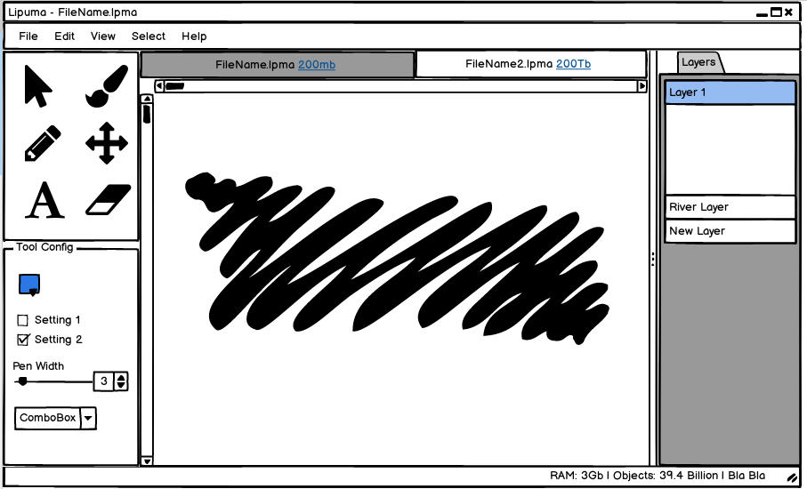

## Program Layout

This is the only feature that I have been able to work on so far, it is a layout of the window as I expect the default layout to be. The specifics of the overall window is only important in the early phases of this program, as I intend to make the windows modular and able to be dynamically moved as needed. This however is a later stage goal, and a sensible default layout is needed in the meantime. 

I came to this (Still WIP) layout by studying the designs of other common art programs such as Krita, Paint Tool SAI, Aseprite, and Photoshop. This is a generally well respected layout, and my main concerns come from how much clutter may start to appear on the screen with time. 

## Program Verbs

I have detailed common verbs that I expect the user to perform and how they should be handled at [This File](./userVerbs.md)
