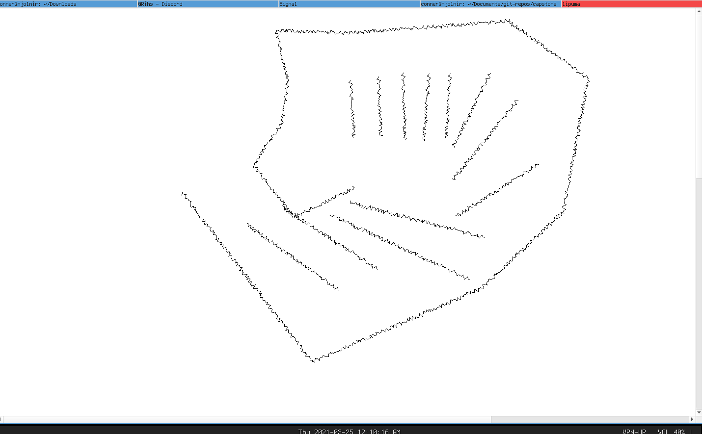
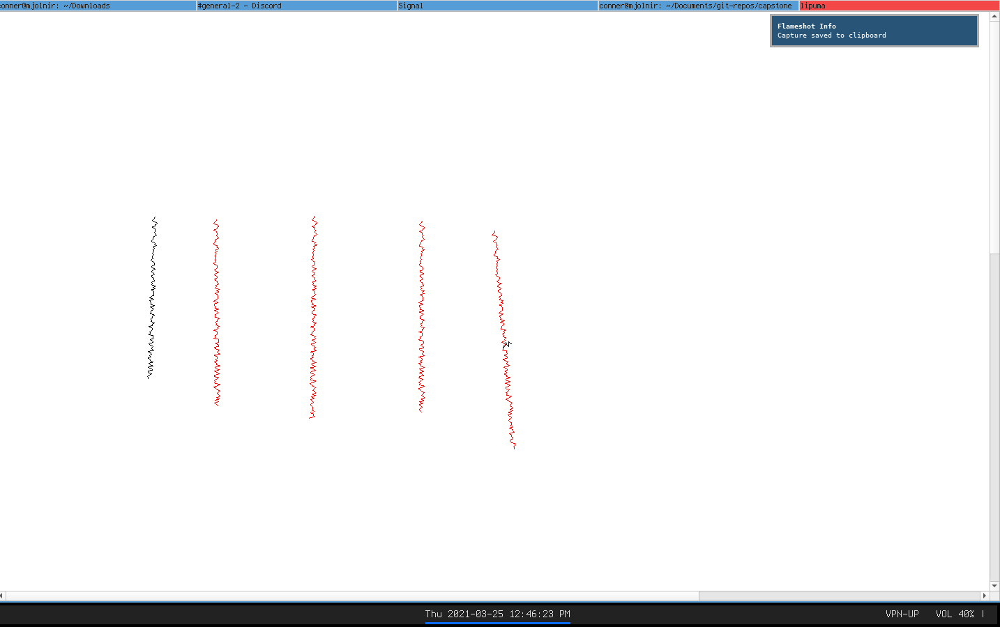
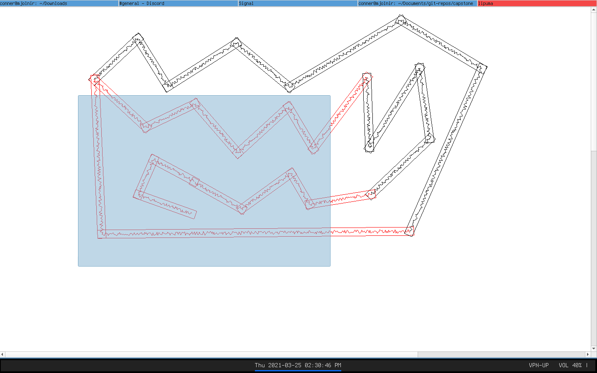
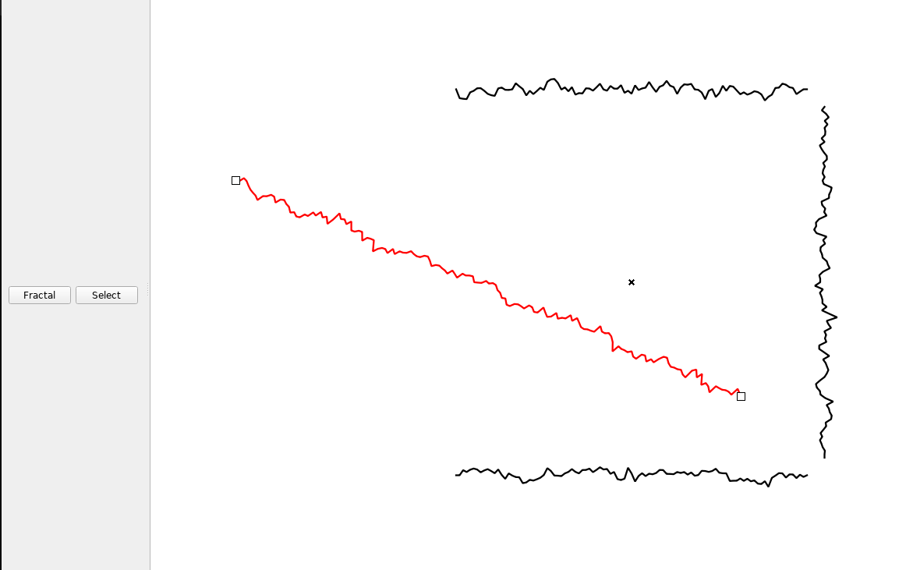

# Proof of Concept

This is the current state of my proof of concept: 

The ability to draw lines.

Highlighting of lines that have been selected with the selection tool.

Lines can be selected using a box selector in the box tool, or by control clicking to select multiple.

After selecting a line, you can move the endpoints around and adjust the location.

Additionally boxes now exist that define the state of the lines.

## Concept Documentation

### Dependancies

The current dependancies for this project are:
- Qt5 framework
- Audburn/FastNoise2
- Catch2 for testing (optional, can be built without tests)

### Build/run instructions

Note: This program has currently only been built on linux, for linux systems. No testing has been done on the recommended windows build toolchain.

1. Install Qt5 with your package manager or from their site
2. Use the instructions for installation from the FastNoise library to install its depenancies
3. in the root directory run `qmake` followed by `make`
4. The binary will be built at `./build/bin/lipuma`
5. Two tools currently can be used in the tool, press S to enable the selection tool, and F to enable the fractal line tool. Selected lines can be deleted with the Del or Backspace keys.

### Current functional state

The current version of the code creates a window that the user can click and drag in order to place fractally deformed lines.

### Attributions

All code in this repository has been written by me, the style guide that I am poorly following is the [Google C++ Style Guide](https://google.github.io/styleguide/cppguide.html).

Some guidance has been obtained from the Qt5 API documentation, to copy commonly used patterns of best design.

## Reflection

I feel relatively confident in my ability to extend this project to a more fully fledged project worth continuing. I have a strong conception of how I will implement a large number of the most important features of this codebase, and I have already found myself making important refactors early on as they need to be implemented.

I think the largest challenge I have faced so far has been in conceptualizing how to communicate with the user, and how to write and describe those interactions. It took me nearly a full week to come up with the "User Verbs" model of analysing user interactions. However after I realized I could frame user interaction in terms of the verbs that a user may wish to do, such as "select" an object or "configure" a tool, this was a strong way to seperate out individual interaction workflows, and have them all available to cross-reference for additional consideration.

I think that, as I write this, I am currently at a point where I have no conceptual barriers in my way preventing further implementation. I know however that in general my biggest issue is having trouble decoupling myself from the in-my-own-head planning process, and simply attempting the most reasonable design that comes to mind. In many cases it is useful for me to talk to others in order to confirm that the ideas I have are not highly flawed in some way I cannot see, which is often my biggest concern.

