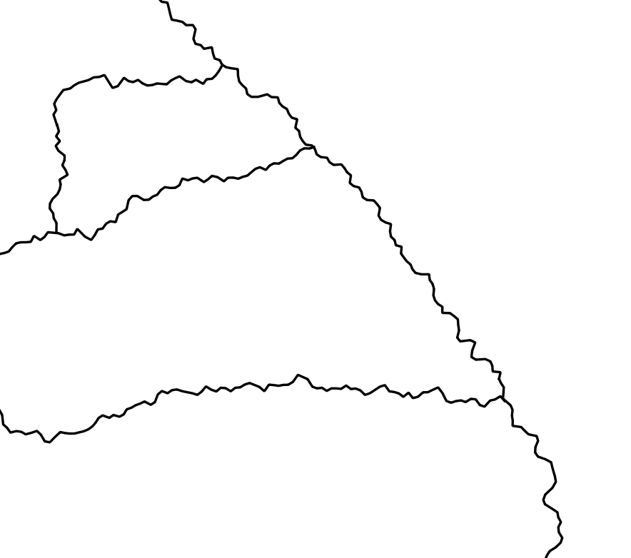
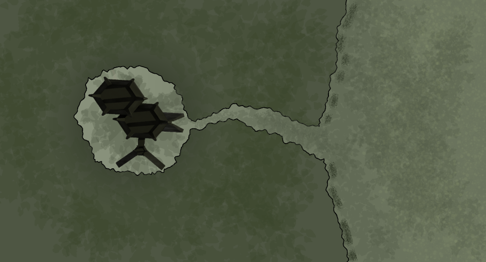

# Lipuma

Lipuma is a tool for drawing fantasy maps quickly and efficiently!

This tool is still in early beta, but can be used to quickly generate natural looking river and coastline formations for maps.

These basic beginnings are already a wonderful speedup to the map making process, allowing for laying out the basics of a map quickly before moving into artistic details in another tool

# Existing features

Saving and loading of project files.

Line drawing and configurable levels of line complexity.

both straight line segments and bezier curve lines.

# Planned features

Configurable line color, weight, and other drawing styles (dotted, transparent, etc.)

Exporting directly to PNG, JPEG, SVG, and other common image formats.

Stamp tool for repeated artistic elements.

# Building

Build instructions TBD

The current dependancies are:

- Qt5
- audburn/FastNoise2